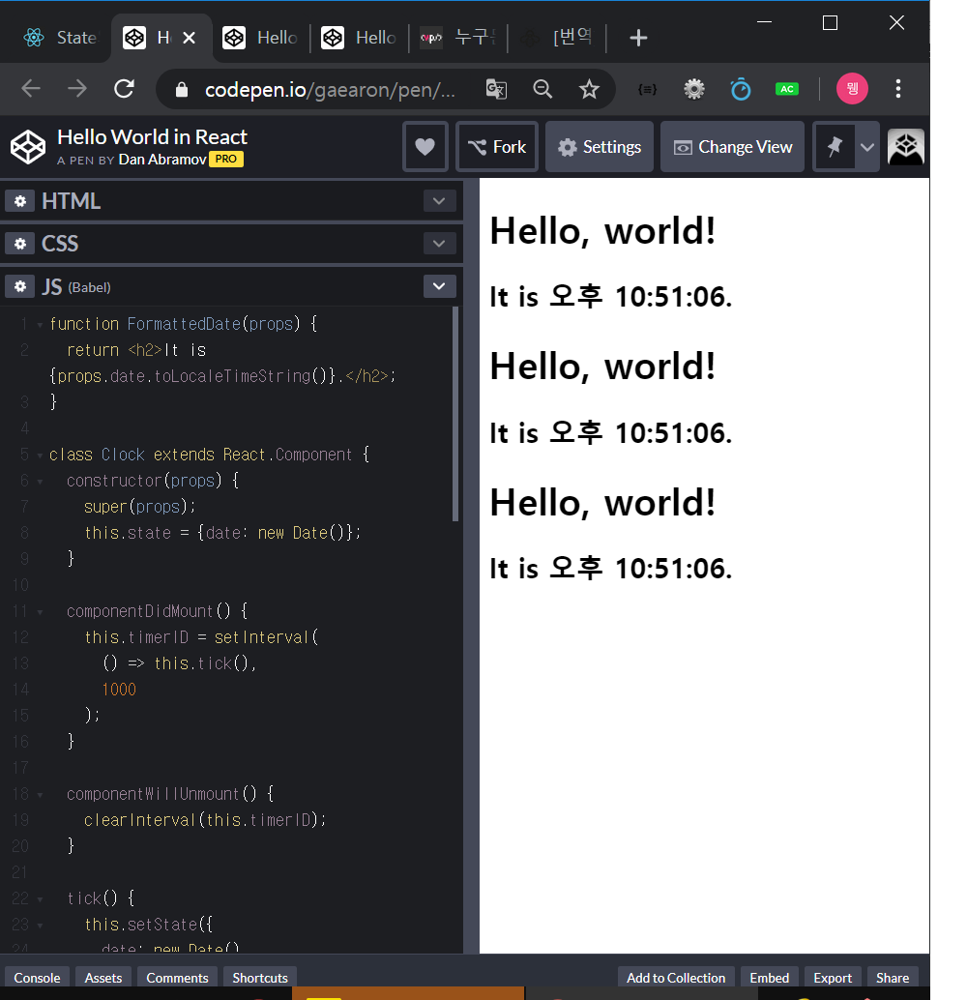

# React 개념 공부 (2)

## 4. state와 라이프사이클

**state** 
: props와 비슷하지만 컴포넌트에 의해 제어되며, private 속성
: class에서만 사용 가능

- 이전의 실시간 시계 예시
  : ReactDOM.render() 를 호출하여 렌더링된 출력을 변경

```react
function tick() {
  const element = (
    <div>
      <h1>Hello, world!</h1>
      <h2>It is {new Date().toLocaleTimeString()}.</h2>
    </div>
  );
  ReactDOM.render(
    element,
    document.getElementById('root')
  );
}

setInterval(tick, 1000);
```

- Clock 컴포넌트 만들기
  : 재사용 가능 / 캡슐화 -> 자체 타이머를 설정하여 스스로 업데이트

```react
// 시계 캡슐화
function Clock(props) {
    return (
    	<div>
        	<h1>Hello, world!</h1>
            <h2>This time is {props.date.toLocaleTimeString()}</h2>
        </div>    
    );
}

function tick() {
    ReactDOM.render(
    	<Clock date={new Date()} />
        document.getElementById('root')
    );
}

setInterval(tick, 1000);
```

- 타이머를 설정하고 매 초 UI업데이트 기능도 Clock컴포넌트에 포함되어있어야함
  -> Clock 컴포넌트에 state 추가해야함
  -> state는 Class에서만 사용가능 == Clock을 클래스로 변경

```react
function Clock(props) {
    return(
    	<div>
        	<h1>Hello, World!</h1>
            <h2>This Time is {props.date.toLocaleTimeString()}</h2>
        </div>
    );
}

ReactDOM.render() {
    <Clock />,
    document.getElementById('root')
}
```


## 4.1 함수(형 컴포넌트)를 클래스로 변환하기

1. ES6 class를 같은 이름으로 만들고, React.Component를 확장
2. 비어있는 render() 메서드 하나 추가
3. 함수의 body를 render() 메서드 안으로 옮기기
4. render() 바디 내에서 props를 this.props로 바꾸기
5. 남아있는 빈 함수 선언문 제거

```react
class Clock extends React.Component {
  render() {
    return (
      <div>
        <h1>Hello, world!</h1>
        <h2>This Time is {this.props.date.toLocaleTimeString()}.</h2>
      </div>
    );
  }
}
```


## 4.2 Class에 로컬 state 추가하기

date를 props에서 state로 옮기자! 3step

1. render() 메서드 내의 this.props.date를 this.state.date로 바꾸기

   ```react
   class Clock extends React.Component {
     render() {
       return (
         <div>
           <h1>Hello, world!</h1>
           <h2>This Time is {this.state.date.toLocaleTimeString()}.</h2>
         </div>
       );
     }
   }
   ```

2. this.state를 초기화하는 클래스생성자를 추가
   클래스 컴포넌트는 항상 props와 함께 기본 생성자(super(props))를 호출함

   ```react
   class Clock extends React.Component {
       constructor(props) {
           super(props);
           this.state = {date: new Date()};
       }
       
       render() {
           return (
           	<div>
               	<h1>Hello, world!</h1>
           		<h2>This Time is {this.state.date.toLocaleTimeString()}.</h2>
               </div>
           );
       }
   }
   ```

3. Clock 요소에서 date prop을 삭제

   ```react
   ReactDOM.render(
   	<clock />,
       document.getElementById('root')
   )
   // 타이머 코드는 컴포넌트 자체에 다시 추가
   ```

- 결과 코드

  ```react
  // 4.1 함수형 컴포넌트를 class로 변경하기
  // (1) React.Component 확장
  class Clock extends React.Component {
      // <2> this.state를 초기화하는 클래스 생성자 추가
      // <3> super(props)로 props를 기본 생성자에 전달
    constructor(props) {
      super(props);
      this.state = {date: new Date()};
    }
  // (2) render() 추가 // (3) 함수의 바디를 render() 안으로 옮기기 
  // (4) render()바디 내 props -> this.props로 변경
    render() {
        // class에 로컬state추가
        // <1> this.props.~ -> this.state.~로 변경
      return (
        <div>
          <h1>Hello, world!</h1>  
          <h2>It is {this.state.date.toLocaleTimeString()}.</h2>
        </div>
      );
    }
  }
  
  ReactDOM.render(
    <Clock />,
    document.getElementById('root')
  );
  ```

  

## 4.3 클래스에 라이프사이클 메서드 추가하기

목표 : Clock에 자체 타이머를 설정하고, 매초마다 자동으로 업데이트 시키자

- Clock이 DOM에서 최초로 랜더링 될 떄, 타이머를 설정 -> "mounting"
- DOM에서 삭제됐을 때 타이머 해제 -> "unmounting"
- Clock을 마운트 / 언마운트 시키기 위해 컴포넌트 클래스에 특별한 메서드를 선언해야함

```react
class Clock extends React.Component {
    constructor(props) {
        super(props);
        // 1-2
        this.state = {date: new Date()};
    }
    // 라이프사이클훅
    // 컴포넌트 출력이 DOM에 랜더링 된 이후 동작
    // 3
    componentDidMount() {
        this.timerID = setInterval(() => this.tick(), 1000)
    }
    
    // 5
    // 타이머 종료
    componentWillUnmount() {
    	clearInterval(this.timerID)    
    }
    
    // tick() 구현 (setState 사용 : 컴포넌트 로컬 state 업데이트 예약)
    // 4
    tick() {
        // 4-2
        this.setState({
            date: new Date()
        });
    }
    
    // 2
    render() {
        return (
        	<div>
            	<h1>Hello, world!</h1>
                {/* 4-4 this.state.date 값 변경 */}
                <h2>It is {this.state.date.toLocaleTimeString()}</h2>
            </div>
        );
    }
}

// 4-3
ReactDOM.render(
    // 1
	<Clock />,
    document.getElementById('root')
)
```

**작업 순서 살펴보기**

1. (1) <Clock />이 ReactDOM.render()에 전달될 때, react는 Clock컴포넌트의 생성자 함수를 호출.

   (2) Clock이 현 시간 화면에 보여질 때, 현 시간을 포함하는 this.state객체 초기화

2. React가 Clock컴포넌트의 render() 메서드를 호출
   -> 무엇을 화면에 보여줘야 하는지 파악
   -> Clock의 랜더링 출력과 일치하도록 DOM 업데이트

3. DOM에 Clock이 그려질 때, componentDidMount() 라이프 훅 호출
   tick() 메서드를 초당 한 번 호출하는 타이머를 설정하라고 브라우저에 명령

4. 브라우저는 매 초마다 tick()메서드 호출
   tick() 메서드 내부에서 setState()를 호출하여 매 초 UI업데이트
   tick() -> setState -> React가 상태 변경 감지 -> render()로 스크린에 표시 -> render() 메서드 내 this.state.date가 바뀜

5. Clock컴포넌트가 DOM에서 삭제될 때, componentWillUnmount() 호출 -> 타이머 종료


## 5. State 바르게 사용하기

1. State 직접 수정 X
   this.state : ONLY **생성자 함수 내부**에서만 지정할 수 있음

   ```react
   // Wrong
   this.state.comment = "hello";
   
   // Correct -> setState 사용하기
   this.setState({comment: "hello"});
   ```

2. State 업데이트는 비동기임
   setState를 호출한 직후에 this.state로 접근하면 에러가 날 수 있음

   ```react
   // Wrong
   this.setState({
       counter: this.state.counter + this.props.increment,
   });
   
   // Correct -> setState(적용할 함수, 바뀔 값) 사용 / arrow함수 사용
   this.setState((prevState, props) => ({
       counter: privState.counter + props.increment
   }));
   
   // Correct
   this.setState(function(prevState, props) {
       return {
           counter: prevState.counter + props.increment
       };
   });
   
   ```

3. State 업데이트는 병합된다
   setState()를 호출할 때, React는 현재 state와 제공한 객체를 병합함

   ```react
   // ex)
   constructor(props) {
       super(props);
       this.state = {
           // state는 여러 독립적인 변수를 가질 수 있음(posts, comments)
           posts: [],
           comments: []
       };
   }
   
   // 개별 setState()를 호출하여 아이템을 각각 업데이트할 수 있음
   componentDidMount() {
       fetchPosts().then(response => {
           this.setState({
               posts: response.posts
           });
       });
       
       retchComments().then(response => {
           this.setState({
               comments: response.comments
           });
       })
   }
   ```

   

## 5.1 데이터의 흐름 (위 -> 아래)

- 부모 or 자식 컴포넌트는 특정 컴포넌트의 state유무를 알 수 없다

- 해당 컴포넌트가 함수나 클래스로 선언되었는지 알 수 없다.

- 컴포넌트 자신 외에는 접근할 수 없음

  -> state가 Local이라고 불리는 이유 / state가 캡슐화된 이유

- 컴포넌트는 자신의 state를 자식 컴포넌트에 props로 전달할 수 있음

  ```react
  <h2>It is {this.state.date.toLocaleTimeString()}</h2>
  // 이 코드는 유저가 정의한 컴포넌트에서도 동작함
  
  <FormatterDate date={this.state.date} />
  // FormattedDate 컴포넌트는 props에서 date를 받지만, 이 값이 Clock상태인지, Clock의 props인지, 혹은 손으로 입력한 건지 알 수 없음.
  ```

- 예시 코드

  ```react
  function FormattedDate(props) {
    return <h2>It is {props.date.toLocaleTimeString()}</h2>;
  }
  
  class Clock extends React.Component {
    constructor(props) {
      super(props);
      this.state = {date: new Date()};
    }
  
    componentDidMount() {
      this.timerID = setInterval(
        () => this.tick(),
        1000
      );
    }
  
    componentWillUnmount() {
      clearInterval(this.timerID);
    }
  
    tick() {
      this.setState({
        date: new Date()
      });
    }
  
    render() {
      return (
        <div>
          <h1>Hello, world!</h1>
          <FormattedDate date={this.state.date} />
        </div>
      );
    }
  }
  
  ReactDOM.render(
    <Clock />,
    document.getElementById('root')
  );
  ```

- 위에서 아래로 흐르는 데이터 흐름을 **하향식** or **단방향** 데이터 흐름이라고 함.
  모든 state는 항상 특정 컴포넌트가 가지면, 해당 state에서 파생된 모든 데이터 또는 UI는 트리의 컴포넌트 **아래**에만 영향을 끼침.

  ```react
  function App() {
    return (
      <div>
        <Clock />
        <Clock />
        <Clock />
      </div>
    );
  }
  
  ReactDOM.render(
    <App />,
    document.getElementById('root')
  );
  ```

  

  

- 각 Clock은 자체적으로 타이머 생성 / 독립적으로 업데이트됨

