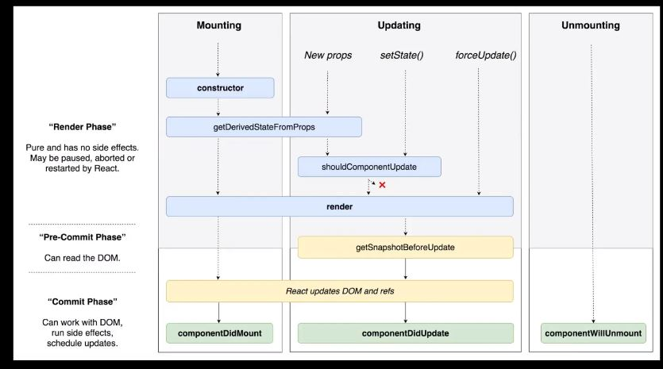

# React_Study Day02

## Props

- 부모 컴퍼넌트가 자식컴퍼넌트한테 값을 전달할 때 사용 (value가 하나의 props임)
ex)` <Child value = "value">` 
- 읽기 전용

```react
// MyName.js

import React, { Component } from 'react';
// react에서 React와 Component를 불러옴

// MyName이라는 클래스를 만들건데,
class MyName extends Component {
  // props가 전달되지 않았을 경우, 기본 props 설정 (1)
  static defaultProps = {
    name: '기본이름'
  };

  // render 안에는 return 이 있어야 한다
  render() {
    return (
      <div>
        {/* 값을 전달받으면 보여주고 싶은 자리에 {this.props.name} 써주기 */}
        안녕하세요! 제 이름은 <b>{this.props.name}</b>입니다
      </div>
    );
  }
}

// props가 전달되지 않았을 때, 기본 props값 설정 (2)
// MyName.defaultProps = {
//   name: '기본이름2'
// };

export default MyName;

```

```react
// App.js

import React, { Component } from 'react';
import MyName from './MyName';

class App extends Component {
  render() {
    // MyName rendering 해주기
    return <MyName name="리액트" />;
  }
}

export default App;
```

출력 결과 :  안녕하세요! 제 이름은 **리액트**입니다 


- 함수형 Components

  : 단순이 값을 받아와서 보여주기만 하는 경우 사용
  

```react
// MyName.js

import React from 'react';
// { component }는 불러올 필요 없음

const MyName = ({ name }) => {
  return <div>안녕하세요! 제 이름은 {name}입니다</div>;
};

// defaultProps 설정
MyName.defaultProps = {
  name: '기본이름'
};

export default MyName;
```

- 비구조화 할당
  위의 코드에서 사용된 문법 예시

```javascript
function Hi({ name, age }) {
    console.log(name + '의 나이는 ' + age + '입니다');
}


Hi({ name: '성원', age: 26 })

결과 : 성원의 나이는 26입니다
```

--> { } dict 에서 전달된 객체의 name값과 age값을 하나하나 추출해서 넣어줌.

위의 MyName코드에서도, Const MyName = (**{ name }**) 은 하나의 객체인데 **name**값을 porps로 받아와서 값을 사용함.

- 함수형 component와 클래스형 component의 차이점
  - state 라는 기능이 없음
  - life cycle 이라는 기능도 없음
- 함수형 component를 사용하는 이유
  - 초기 마운트 속도가 아주 조금 더 빠르다
  - 불필요한 기능이 없어서 메모리를 절약할 수 있음


--------------


## State

- 컴포넌트 자신이 들고있는 것. (상속X)
- 변화가 필요할 때, **setState()**를 통해서 값을 설정함
- 변경 가능

```react
// Counter.js

import React, { Component } from 'react';

class Counter extends Component {
  // state 정의해주기 : 반드기 '객체'여야함
  state = {
    number: 0
  };

  // 값을 변화시키기 위해서 Custom함수를 만들어야함
  handleIncrease = () => {
    // 값을 update할 때는 항상 setState()라는 함수를 사용해야 한다!! 그래야 Component가 변화를 감지할 수 있음
    this.setState({
      number: this.state.number + 1
    });
  };

  // 화살표 함수로 작성한 이유 : 함수 내부에서 this가 뭔지 알도록 하기 위해
  handleDecrease = () => {
    this.setState({
      number: this.state.number - 1
    });
  };

  render() {
    return (
      <div>
        <h1>카운터</h1>
        <div>값: {this.state.number}</div>
        {/* 버튼이 눌렸을 때, 값이 변하게 한다 -> 이벤트 설정 */}
        <button onClick={this.handleIncrease}>+</button>
        <button onClick={this.handleDecrease}>-</button>
      </div>
    );
  }
}

export default Counter;

```

```react
import React, { Component } from 'react';
import Counter from './Counter';

class App extends Component {
  render() {
    return <Counter />;
  }
}

export default App;
```


-----------------

## LifeCycle API (생명주기)

- Component가 나타날 때 / 업데이트 될 때 / 사라질 때 어떤 일을 하고싶으면 LifeCycle API 사용



- Mounting : 컴포넌트가 우리 브라우저 상에 나타나는 것
- Updating : 컴포넌트의 props나 state가 바뀌는 것
- Unmounting : 컴포넌트가 브라우저 상에서 사라질 때

### constructor

- 생성자 함수
- 컴포넌트가 처음 브러우저에 나타날 때, 만들어지는 과정에서 가장 처음 실행되는 함수
- 컴포넌트가 가지고있을 state의 초기설정을 함 


### getDerivedStateFromProps

- props로 받은 값을 state에 동결시키고 싶을 때 사용
- 마운팅, 업데이팅 과정에서도 프롭스가 바뀌면 실행됨


### render

- 어떤 DOM을 만들지, 내부 태그에는 어떤 값을 전달할지 정의


### componentDidMount

- 랜더링되어 브라우저 상에서 나타나게 되면 이 함수 호출
- 주로 외부 라이브러리를 사용할 때, 특정 DOM에 차트를 그리게 할 수 있음
- API, ajax요청 시 처리
- component가 나타난 후 몇 초 후 어떤 이벤트를 하고 싶을 때 등등 사용
- 특정 컴퍼넌트가 브라우저에 나타난 시점에서 몇초 후 어떤 작업을 할지 설정해주는 함수


### shouldComponentUpdate

- 컴포넌트가 업데이트되는 성능을 최적화시키고싶을 때 사용
- 컴포넌트는 부모 컴포넌트가 re랜더링되면 자식컴포넌트도 re랜더링됨
  but 이 작업이 필요하지 않을 수가 있음
  기존 방식 : render함수가 virtual DOM상에 그렸다가, 차이점만 브라우저에 반영하는 방식 -> virtual DOM에 그릴 때 조차 성능을 아끼고싶을 때 사용


### getSnapshotBeforeUpdate

- render 된 후에 실행되는 함수
- 랜더링 한 다음, 랜더링한 결과물이 브라우저에 반영되기 직전에 호출됨
- 업데이트 전, ex 스크롤의 위치, DOM의 크기 등을 사전에 가져오고 싶을 때 사용


### componentDidUpdate

- 작업을 마치고 컴포넌트가 업데이트 되었을 때 호출
- state가 바뀌었다면, 이전 상태와 지금 상태의 달라진 부분을 찾아서 작업을 한다
  ex) page가 바뀌었다 -> page를 바꾸는 작업을 해준다


### componentWillUnmount

- 컴포넌트가 사라지는 과정에서 호출
- componentDidMount에서 설정한 이벤트리스너들을 삭제함

